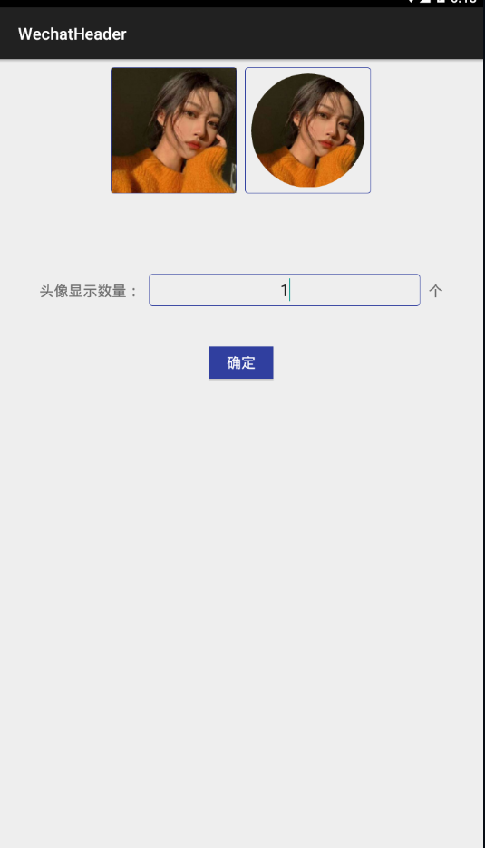
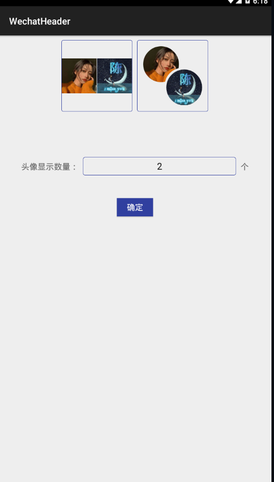
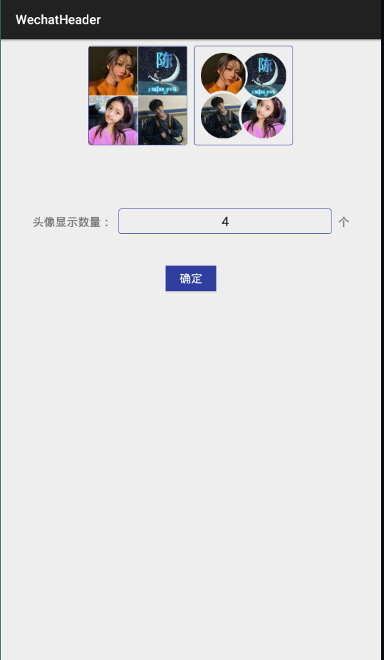
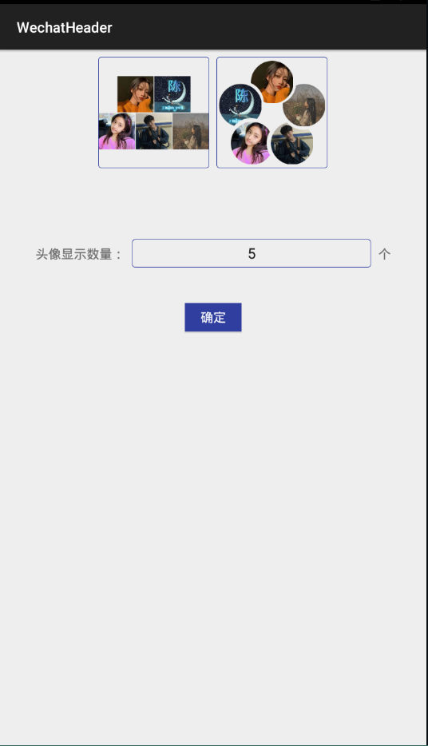
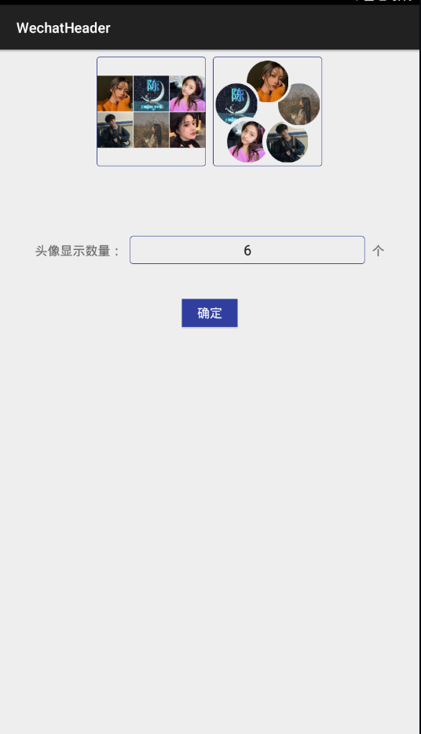
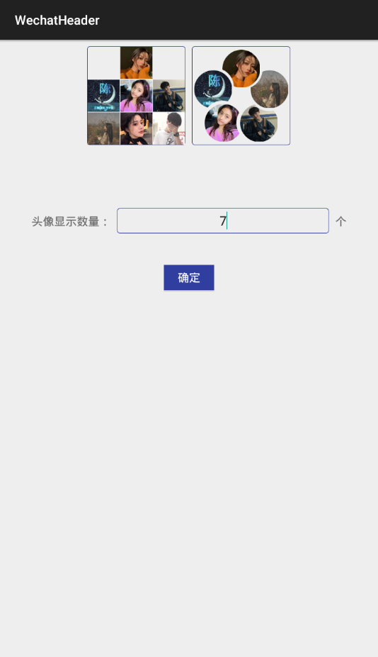
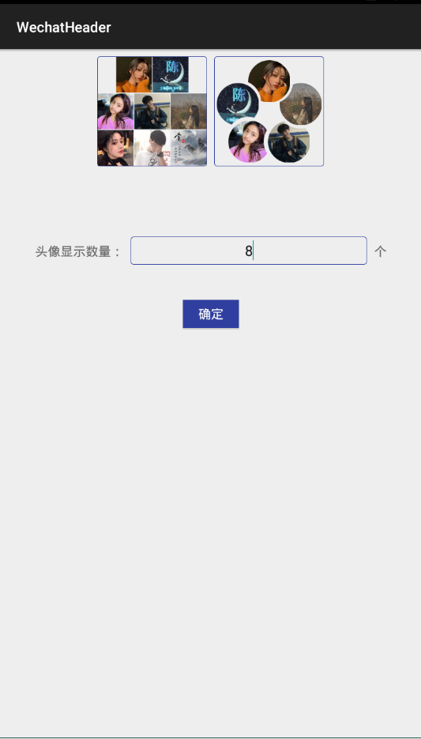
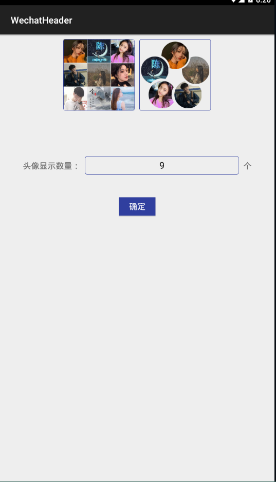

# WechatHeader
仿微信群聊和QQ头像群聊，参考一篇文章的启发实现:https://blog.csdn.net/qq_25815655/article/details/81382915
# 采用了三种方案分别实现：
# 1.直接写成布局，然后按照不同的布局加载不同张数的图片。
# 2.自定义一个控件，还是通过异步的方式下载所有图片。
# 3.还是使用原生的控件，对群图像进行合并后生成一个新的图像，原后进行缓存。将合并算法抽象成接口。

